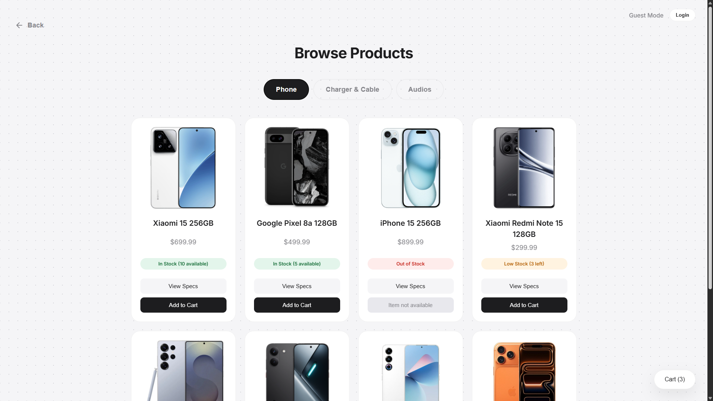
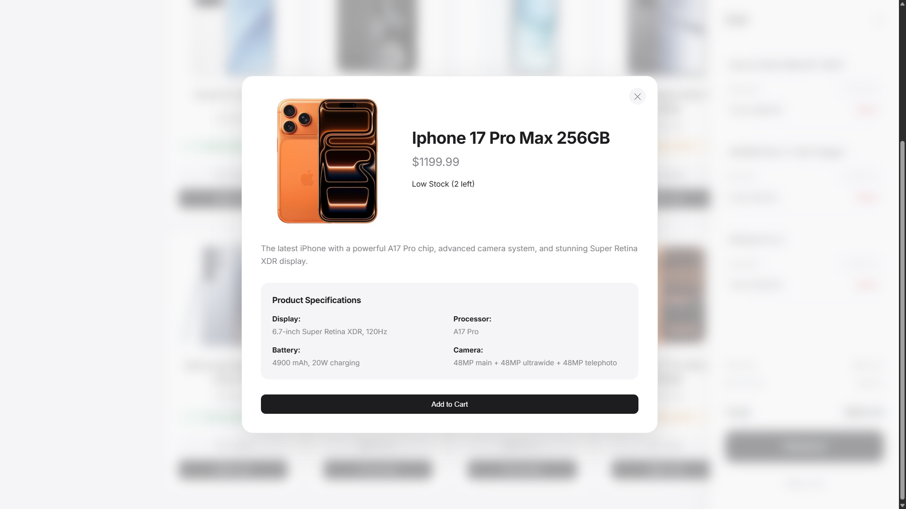
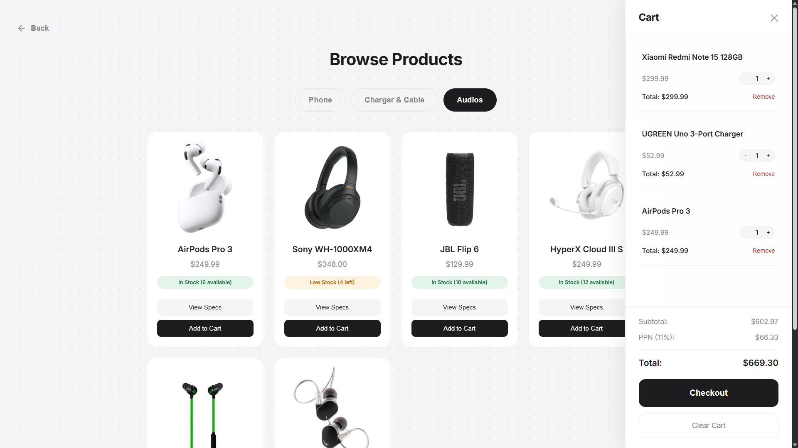

## 📸 Project Previews

# 📱 Simple Phone Store Website

A fully functional, responsive e-commerce web application built for a phone and accessories store. This project features user authentication, a dynamic shopping cart, a database-driven product catalogue, and a secure Admin Panel for inventory and order management.

## ✨ Features

* **User Authentication:** Secure login and registration system with encrypted password hashing.
* **Role-Based Access:** Distinct privileges for standard `customers` and `admin` users.
* **Dynamic Cart System:** Real-time subtotal and 11% PPN tax calculations.
* **Checkout & Inventory:** Automated stock deduction upon checkout (with Admin bypass capabilities).
* **Admin Dashboard:** Secure backend panel to update product prices, adjust stock levels, and view customer order history (including Name and WhatsApp contact links).
* **Responsive UI:** Clean, modern, Apple-inspired interface with glass-morphism effects.

## 🛠️ Technologies Used

* **Frontend:** HTML5, CSS3, Vanilla JavaScript
* **Backend:** PHP (API and Authentication logic)
* **Database:** MySQL
* **Environment:** XAMPP (Apache server)

## 🚀 How to Run Locally (Step-by-Step)

To run this project on your computer, you will need a local server environment capable of running PHP and MySQL. We recommend using **XAMPP**.

### Step 1: Install Prerequisites
1. Download and install [XAMPP](https://www.apachefriends.org/index.html) for your operating system.
2. Open the XAMPP Control Panel and click **Start** next to **Apache** and **MySQL**. (Both should turn green).

### Step 2: Download the Project
1. Clone this repository by running the following in your terminal:
   git clone [https://github.com/diazabiansyahramdani-cmd/Simple-Phone-Store-Website.git](https://github.com/diazabiansyahramdani-cmd/Simple-Phone-Store-Website.git)

### Step 3: Place the Files in Your Server

1. Locate your XAMPP installation folder (usually `C:\xampp` on Windows).
2. Open the `htdocs` folder inside XAMPP.
3. Create a folder named `SI25I` and move the downloaded project folder inside it.
4. Rename the project folder to `Website Project`.
* *Your final file path should look exactly like this:* `C:\xampp\htdocs\SI25I\Website Project\`

### Step 4: Set Up the Database

1. Open your web browser and go to: `http://localhost/phpmyadmin`
2. Look at the left sidebar and click **New** to create a new database.
3. Name the database **`product`** and click **Create**.
4. Click on your newly created `product` database on the left sidebar.
5. Click the **Import** tab at the top of the screen.
6. Click **Choose File** and select the `product.sql` file located inside your downloaded project folder.
7. Scroll to the bottom and click **Import** (or Go). You should see a success message indicating your tables have been created.

### Step 5: Launch the Website

1. Open your web browser.
2. Type the following URL exactly as shown:
`http://localhost/SI25I/Website%20Project/Object.html`

3. Press Enter. The website will load and automatically connect to your local database!

## 👑 Default Admin Access

To manage inventory and view orders, log in using the Admin Panel button.

* **Username:** Admin1
* **Password:** *(Use the password you set during creation, or run `setup_admin.php` in your browser to generate a new secure password)*
